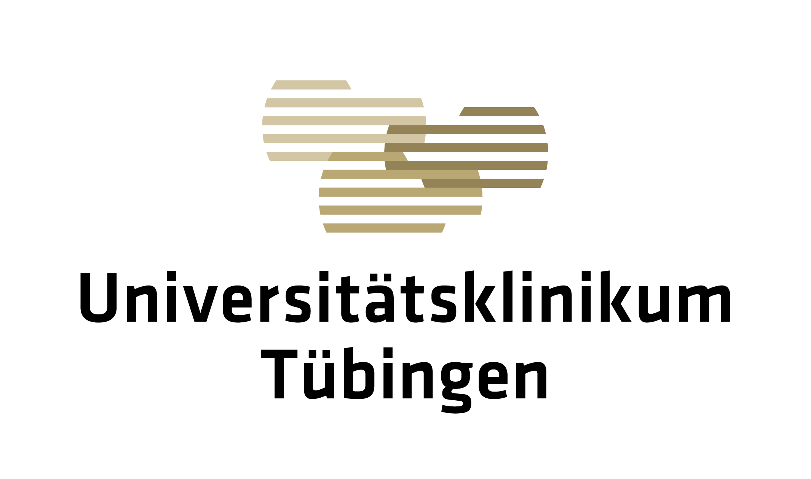
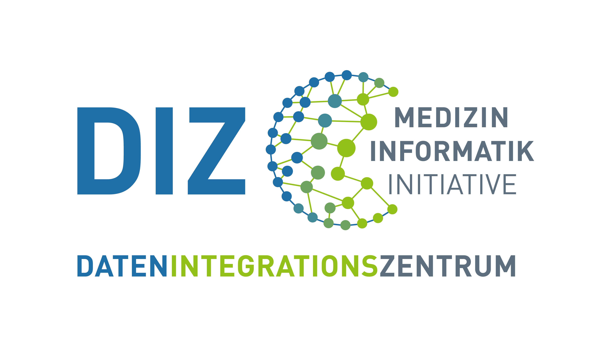
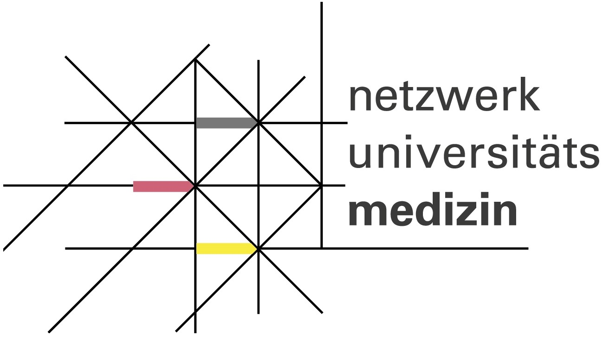

## Medical Data Integration Center (meDIC)

The [Medical Data Integration Center (meDIC)](https://www.medizin.uni-tuebingen.de/de/das-klinikum/einrichtungen/institute/informationstechnologie-und-medizininformatik/medic) at [University Hospital Tübingen](https://www.medizin.uni-tuebingen.de/en-de/startseite), which was developed as part of the [Medical Informatics Initiative](https://www.medizininformatik-initiative.de/en/start), aims to improve both biomedical research and patient care through innovative IT solutions. It also aims to enable data access across the boundaries of institutes and sites, as far as the legal framework allows.

The meDIC is funded as part of the Medical Informatics Initiative of the [Federal Ministry of Research, Technology and Space (BMFTR)](https://www.bmbf.de/DE/Home/home_node.html). The [University of Tübingen](https://uni-tuebingen.de/en/) and the University Hospital of Tübingen are working together with partner sites in Munich, Ulm, Augsburg, Homburg and Regensburg as part of the DIFUTURE (Data Integration for Future Medicine) consortium.

 

  

